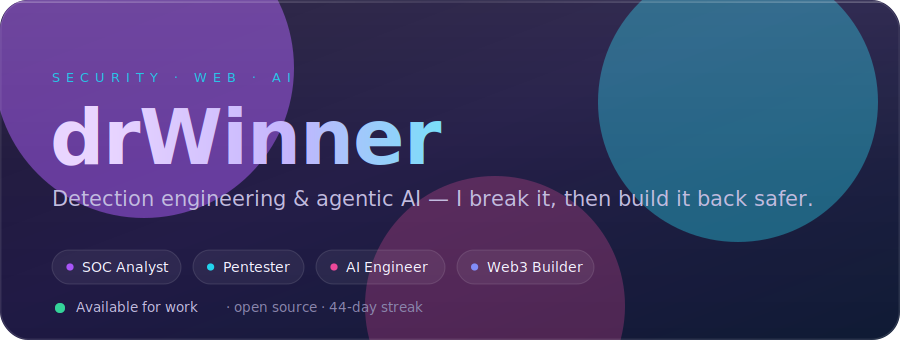
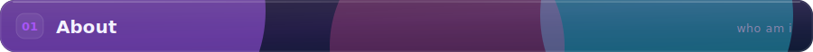
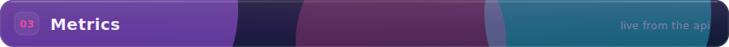
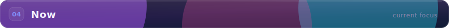

<!-- Profile: dr-winner — Aurora-Glass theme. Every visual in ./assets is hand-built
     SVG (hero, glass section headers, panels, stats) refreshed by .github/workflows.
     No third-party embed and no default-GitHub table/heading chrome. -->

  

  
  &nbsp;
  
  &nbsp;
  

 

I work where **defence and AI** meet — building detections, running incidents, and writing automation that actually removes toil. I also ship from a **web + smart-contract** background (Next.js, EVM, Solidity), so I reason like both a **builder** and a **blue-teamer**: break it, then build it back safer. Currently focused on **agentic AI for security operations** and shipping clean, fast interfaces on top of it.

 

 

Every stat above is regenerated from the live GitHub API twice a day by a <a href="./.github/workflows/stats.yml">GitHub Action</a> and committed as SVG — served from this repo, so nothing rate-limits or breaks.

 

 

  
  
  
  

more places to find me

 
  
  
  
  
  
  
  

 

  <i>Build secure systems. Ship clean interfaces. Defend the stack.</i>

