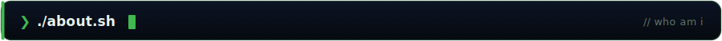
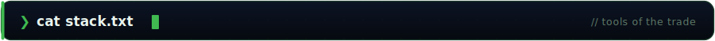
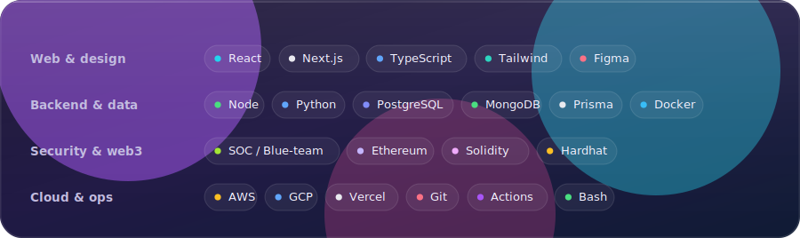
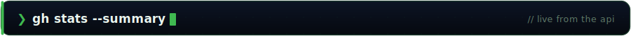
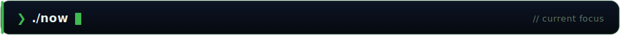
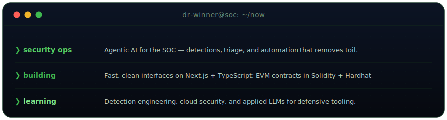

<!-- Profile: dr-winner — SOC console theme. Every visual in ./assets is hand-built
     SVG (banners, panels, stats) refreshed by .github/workflows. No third-party
     embed and no default-GitHub table/heading chrome = one cohesive console. -->

<p align="center">
  <a href="https://github.com/dr-winner">
    
  </a>
</p>

<p align="center">
  <a href="https://duvorrichardwinner.me"></a>
  &nbsp;
  <a href="mailto:duvorrichardwinner@gmail.com"></a>
  &nbsp;
  <a href="https://www.linkedin.com/in/richard-winner-duvor/"></a>
  &nbsp;
  <a href="https://x.com/dr_winner6"></a>
  &nbsp;
  
  &nbsp;
  <a href="https://github.com/dr-winner?tab=followers"></a>
</p>

<br />

<p></p>

I work where **defence and AI** meet — building detections, running incidents, and writing automation that actually removes toil. I also ship from a **web + smart-contract** background (Next.js, EVM, Solidity), so I reason like both a **builder** and a **blue-teamer**: break it, then build it back safer. Currently focused on **agentic AI for security operations** and shipping clean, fast interfaces on top of it.

```yaml
role:     SOC · pentest · AI · web3
open_to:  security engineering · AI-integrated roles
based_in: Accra, Ghana  (GMT+0)
stack:    TypeScript · Python · Solidity · Next.js
links:    duvorrichardwinner.me · github.com/dr-winner
```

<br />

<p></p>

<p align="center"></p>

<br />

<p></p>

<p align="center"></p>
<p align="center"></p>
<p align="center"></p>

<p align="center"><sub>Every stat above is regenerated from the live GitHub API twice a day by a <a href="./.github/workflows/stats.yml">GitHub Action</a> and committed as SVG — served from this repo, so nothing rate-limits or breaks.</sub></p>

<br />

<p></p>

<p align="center"></p>

<br />

<p></p>

<p align="center">
  <a href="https://duvorrichardwinner.me"></a>
  <a href="mailto:duvorrichardwinner@gmail.com"></a>
  <a href="https://github.com/dr-winner"></a>
  <a href="https://www.linkedin.com/in/richard-winner-duvor/"></a>
  <a href="https://x.com/dr_winner6"></a>
</p>

<details>
<summary align="center"><sub>more places to find me</sub></summary>
<p align="center"><br />
  <a href="https://medium.com/@duvorr60"></a>
  <a href="https://drwinner.hashnode.dev"></a>
  <a href="https://www.dev.to/dr-winner"></a>
  <a href="https://www.tiktok.com/@procoder"></a>
  <a href="https://www.instagram.com/winner.richard"></a>
  <a href="https://t.me/dr_winner"></a>
  <a href="https://www.behance.net/duvorrichard"></a>
</p>
</details>

<br />

<p align="center">
  <sub><i>Build secure systems. Ship clean interfaces. Defend the stack.</i></sub>
</p>
