<!-- Profile: dr-winner — SOC console theme. Art in ./assets is hand-built SVG,
     refreshed by .github/workflows/stats.yml. No third-party embed = no ? cards. -->

<p align="center">
  <a href="https://github.com/dr-winner">
    
  </a>
</p>

<p align="center">
  <a href="https://duvorrichardwinner.me"></a>
  <a href="mailto:duvorrichardwinner@gmail.com"></a>
  <a href="https://www.linkedin.com/in/richard-winner-duvor/"></a>
  <a href="https://x.com/dr_winner6"></a>
  
  <a href="https://github.com/dr-winner?tab=followers"></a>
</p>

<br />

### `❯ ./about.sh`

<table border="0" cellspacing="0" cellpadding="12" width="100%">
<tr>
<td width="58%" valign="top">

I work where **defence and AI** meet — building detections, running incidents, and writing automation that actually removes toil. I also ship from a **web + smart-contract** background (Next.js, EVM, Solidity), so I reason like both a **builder** and a **blue-teamer**: break it, then build it back safer.

Currently focused on **agentic AI for security operations** and shipping clean, fast interfaces on top of it.

</td>
<td width="42%" valign="top">

```yaml
role:     SOC · pentest · AI · web3
open_to:  security engineering
          · AI-integrated roles
based_in: Accra, Ghana  (GMT+0)
stack:    TypeScript · Python
          · Solidity · Next.js
links:    portfolio · github · repos
```

</td>
</tr>
</table>

<br />

### `❯ cat stack.txt`

<table border="0" cellspacing="0" cellpadding="6" width="100%">
<tr>
<td align="left" width="22%" valign="top"><b>Web&nbsp;&amp;&nbsp;design</b></td>
<td align="left" valign="top">


</td>
</tr>
<tr>
<td align="left" valign="top"><b>Backend&nbsp;&amp;&nbsp;data</b></td>
<td align="left" valign="top">


</td>
</tr>
<tr>
<td align="left" valign="top"><b>Security&nbsp;&amp;&nbsp;web3</b></td>
<td align="left" valign="top">


</td>
</tr>
<tr>
<td align="left" valign="top"><b>Cloud&nbsp;&amp;&nbsp;ops</b></td>
<td align="left" valign="top">


</td>
</tr>
</table>

<br />

### `❯ gh stats --summary`

<p align="center">
  
</p>
<p align="center">
  
</p>

<sub>Numbers are regenerated from the live GitHub API twice a day by a <a href="./.github/workflows/stats.yml">GitHub Action</a> and committed as SVG — served from this repo, so they never rate-limit or show a broken card.</sub>

<p align="center">
  
</p>

<br />

### `❯ ./now`

<table border="0" cellspacing="0" cellpadding="8" width="100%">
<tr>
<td width="33%" valign="top">

**🛡️ Security ops**
Agentic AI for the SOC — detections, triage, and automation that removes toil. Hands-on with an AWS threat-detection lab.

</td>
<td width="33%" valign="top">

**⚙️ Building**
Shipping fast, clean interfaces on Next.js + TypeScript, and smart contracts on the EVM (Solidity / Hardhat).

</td>
<td width="33%" valign="top">

**🌱 Learning**
Going deeper on detection engineering, cloud security, and applied LLMs for defensive tooling.

</td>
</tr>
</table>

<br />

### `❯ ./connect`

<p align="center">
  <a href="https://duvorrichardwinner.me"></a>
  <a href="mailto:duvorrichardwinner@gmail.com"></a>
  <a href="https://github.com/dr-winner"></a>
  <a href="https://www.linkedin.com/in/richard-winner-duvor/"></a>
  <a href="https://x.com/dr_winner6"></a>
</p>

<details>
<summary align="center"><sub>more places to find me</sub></summary>
<p align="center"><br />
  <a href="https://medium.com/@duvorr60"></a>
  <a href="https://drwinner.hashnode.dev"></a>
  <a href="https://www.dev.to/dr-winner"></a>
  <a href="https://www.tiktok.com/@procoder"></a>
  <a href="https://www.instagram.com/winner.richard"></a>
  <a href="https://t.me/dr_winner"></a>
  <a href="https://www.behance.net/duvorrichard"></a>
</p>
</details>

<br />

<p align="center">
  <sub><code>❯ echo $CREDO</code> &nbsp;·&nbsp; <i>Build secure systems. Ship clean interfaces. Defend the stack.</i></sub>
</p>
