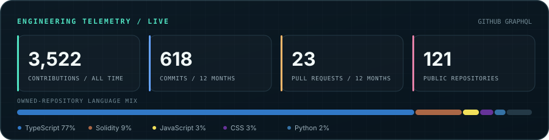
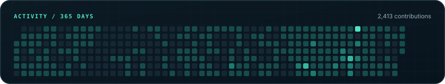

<!--
  GitHub profile for @dr-winner.
  Signature visuals are generated from scripts/ and committed locally so the
  profile stays fast, accessible, and independent of third-party card services.
-->

  

  
  
  
  

## About

Security engineer with a builder's background. I work across **SOC operations, penetration testing, application security, and cloud security**—investigating attacks, tracing weaknesses through code and infrastructure, and shipping practical fixes.

## Selected work

- **[Hardened Flask delivery](https://github.com/dr-winner/npontu-devops)** — Containerized delivery with a non-root runtime, health checks, GHCR publishing, and Azure Container Apps deployment. Flask · Docker · GitHub Actions · Azure
- **[Security portfolio platform](https://github.com/dr-winner/portfolio)** — Secure admin sessions, rate-limited APIs, sanitized uploads, telemetry, and an operational CMS. Next.js · TypeScript · PostgreSQL · Vercel
- **[CareerOS](https://github.com/dr-winner/careeros)** — Production-minded platform with an audited data model and non-destructive database migration workflow. Next.js · React · Prisma · Neon
- **[Roster](https://github.com/dr-winner/roster)** — Memory-backed hiring agent where prior outcomes alter future eligibility, with ACP orchestration and signed settlement flows. Python · FastAPI · Sibyl · Base

## Security practice

- **SOC & detection** — Alert triage, threat hunting, log analysis, SIEM workflows, and MITRE ATT&CK.
- **Pentest & AppSec** — Attack-surface review, web testing, Burp Suite, Nmap, and remediation guidance.
- **Cloud & platform** — IAM, secure configuration, containers, CI/CD guardrails, AWS, Azure, and GCP.

## Engineering telemetry

  

  

Generated from the GitHub API by a scheduled <a href="./.github/workflows/stats.yml">GitHub Action</a>. Self-hosted SVGs mean no third-party card outages or rate-limit placeholders.

## Current focus

- Building stronger cloud-security and detection-engineering labs with reproducible evidence.
- Turning repetitive security workflows into small, reviewable automation.
- Shipping systems whose operational behavior is as intentional as their interface.

---

  <strong>Open to SOC, penetration-testing, application-security, and cloud-security roles.</strong> 
  Accra, Ghana · GMT · <a href="https://duvorrichardwinner.me/#contact">duvorrichardwinner.me</a>

